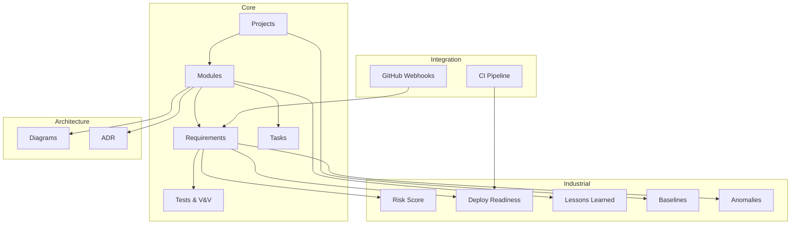

# Orbiter

**Project management built for traceability and AI-assisted development.**

Orbiter est un outil de gestion de projet open source inspiré de l'ingénierie système NASA/SpaceX, adapté au développement logiciel. Il offre une traçabilité complète **exigence → test → code → preuve**, pensé pour être exploitable par des humains ET par des agents IA.

## Pourquoi Orbiter ?

Les outils classiques (Jira, Linear, Notion) trackent des tickets. Orbiter tracke des **exigences** et leur **preuve de satisfaction** — comme en ingénierie système, mais adapté au logiciel.

- **Traçabilité bidirectionnelle** — De l'exigence au commit, du commit à l'exigence. Si un lien manque, Orbiter le signale.
- **V&V séparées** — "Vérifié" (les tests passent en CI) ≠ "Validé" (le client confirme en staging). Les deux sont trackés.
- **Risk Score FMEA** — Chaque exigence a un score de risque : Impact × Probabilité × (6 - Détectabilité). On teste en priorité ce qui est risqué.
- **Deploy Readiness** — Avant chaque déploiement, un check GO/NO-GO automatique par module. Inspiré des Flight Readiness Reviews NASA.
- **Context Brief IA** — Pour chaque exigence, un briefing contextuel structuré (REQ + module + ADR + tests + lessons + risque) consommable par Claude Code ou tout agent IA.

## Stack

```
Laravel 13 (PHP 8.4)
├── Blade Components (UI)
├── Livewire 4 (réactivité serveur)
├── Tailwind CSS 4 (styling)
├── PostgreSQL 16 (JSONB)
├── FrankenPHP (Octane)
├── Pest PHP (tests)
└── Mermaid.js + frappe-gantt (seul JS externe)
```

**Philosophie : simplicité radicale.** Pas de Vue, pas de React, pas d'Inertia, pas de SPA. Le navigateur fait le travail (`<dialog>`, Popover API, `<details>/<summary>`). Inspiré par [Spatie — "Rethinking our frontend future"](https://spatie.be/blog/rethinking-our-frontend-future).

## Quick Start

```bash
git clone https://github.com/matthieuLabaune/orbiter.git
cd orbiter
docker compose up -d
docker compose exec app php artisan migrate --seed
```

Ouvrir http://localhost:8080 — Login : `demo@orbiter.dev` / `password`

Le seeder crée un projet **"Orbiter v1"** avec des données réalistes : 7 modules, 13 exigences, 10 tests, 16 tâches, 4 ADR, 3 lessons learned, 1 baseline et 2 anomalies.

## Modules

| Module | Description |
|--------|-------------|
| **Projects** | Projets, membres et rôles |
| **Modules** | Découpage fonctionnel avec dépendances inter-modules |
| **Requirements** | Exigences avec statut V&V, versioning et Risk Score FMEA |
| **Tests & V&V** | Registre de tests, exécutions, matrice de traçabilité |
| **Planning** | Tâches avec dépendances, Gantt et Kanban |
| **Architecture** | Diagrammes Mermaid auto-générés depuis les modules |
| **ADR** | Architecture Decision Records avec liens modules/exigences |
| **Dashboard** | Santé projet par module, alertes, activité récente |
| **Deploy Readiness** | Revue GO/NO-GO automatique avant déploiement |
| **Lessons Learned** | Capitalisation des apprentissages par module |
| **Baselines** | Snapshots immuables de l'état du projet à chaque release |
| **Anomaly Taxonomy** | Classification : Anomalie / Non-conformité / Défaut |
| **Context Brief IA** | Briefing contextuel par exigence pour agents IA |

## Architecture



## Mesure d'avancement

L'avancement d'un projet ne se mesure pas en tickets fermés. Orbiter mesure 4 axes :

| Axe | Question | Indicateur |
|-----|----------|-----------|
| **Formalisation** | Les besoins sont-ils écrits ? | % d'exigences avec critères d'acceptation |
| **Couverture** | Les exigences sont-elles testées ? | % d'exigences avec au moins un test |
| **Vérification** | Les tests passent-ils ? | % d'exigences dont tous les tests passent |
| **Validation** | Le client confirme-t-il ? | % d'exigences validées en staging |

L'avancement réel = taux de validation. Les 3 autres sont des indicateurs avancés.

## Développement

```bash
docker compose up -d                              # Lancer les containers
docker compose exec app php artisan migrate       # Migrations
docker compose exec app php artisan test           # Tests (Pest)
docker compose exec app php artisan db:seed        # Données démo
```

### Conventions de commit

```
<type>(<module>): description courte

REQ-XXX - Titre de l'exigence
Covers: TEST-XXXa, TEST-XXXb
```

Types : `feat`, `fix`, `test`, `refactor`, `docs`, `chore`, `infra`

## Documentation

| Document | Description |
|----------|-------------|
| [`CLAUDE.md`](CLAUDE.md) | Guide de développement pour Claude Code |
| [`docs/architecture.md`](docs/architecture.md) | Architecture technique avec diagramme Mermaid |
| [`docs/methodology.md`](docs/methodology.md) | Méthodologie "Project as Context" |
| [`docs/glossary.md`](docs/glossary.md) | Glossaire des termes Orbiter |
| [`docs/adr/`](docs/adr/) | Architecture Decision Records |

## Licence

[MIT](LICENSE)
