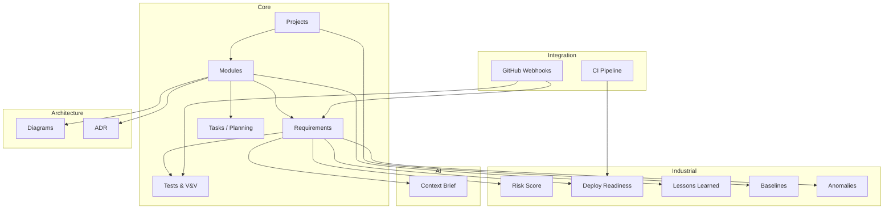

# Architecture — Orbiter

## Diagramme des modules

## Stack technique

- **Backend** : Laravel 13 (PHP 8.4) + Octane/FrankenPHP
- **Frontend** : Blade Components + Livewire 3
- **CSS** : Tailwind CSS 4
- **DB** : PostgreSQL 16 (JSONB)
- **Diagrammes** : Mermaid.js
- **Gantt** : frappe-gantt
- **Auth** : Laravel Breeze (Blade)
- **Tests** : Pest PHP
- **Infra** : Docker (FrankenPHP + PostgreSQL + Redis)
